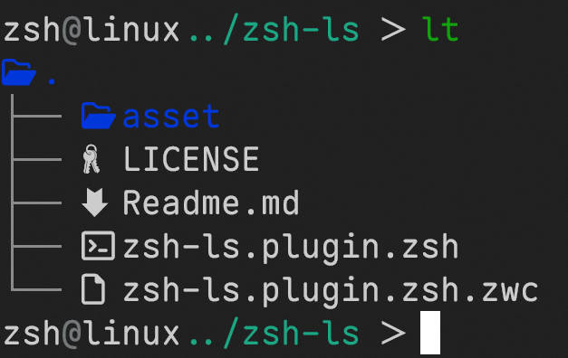

# ZSH-LS



ZSH 的 ls 别名插件。

Ls aliases plugin for zsh.

该插件支持 [lsd](https://github.com/lsd-rs/lsd)，[exa](https://github.com/ogham/exa)/[eza](https://github.com/eza-community/eza) 和 [ls](https://linux.die.net/man/1/ls)/[tree](https://linux.die.net/man/1/tree) 作为后端。

This plugin supports [lsd](https://github.com/lsd-rs/lsd), [exa](https://github.com/ogham/exa)/[eza](https://github.com/eza-community/eza) and [ls](https://linux.die.net/man/1/ls)/[tree](https://linux.die.net/man/1/tree) backends.

## 提示 Note

可以通过设置 `ZSH_LS_PREFER_LSD`、`ZSH_LS_PREFER_EZA`、`ZSH_LS_PREFER_EXA` 或者 `ZSH_LS_PREFER_LS` 来指定后端程序，就像：

You can change ls backend via set `ZSH_LS_PREFER_LSD`, `ZSH_LS_PREFER_EZA`, `ZSH_LS_PREFER_LSD` or `ZSH_LS_PREFER_LS`, like:

```sh
export ZSH_LS_PREFER_EZA=true
```

如果环境中不存在以上变量，将会自动选择 `lsd`、 `eza`/`exa` 或 `ls`。

If no one above is defined as environment variable then backend will be selected automatically: `lsd`, or `eza`/`exa`, or `ls`.

注意，如果它回退到 `exa` 或者 `ls` （而不是通过 `ZSH_LS_PREFER_EXA` 或 `ZSH_LS_PREFER_LS`），那么它将会抛出一个警告。如果你想要抑制该警告，请在环境中设置 `ZSH_LS_NO_WARN`，就像：

Note. If it falls back to `exa` or `ls` (not via `ZSH_LS_PREFER_EXA` or `ZSH_LS_PREFER_LS`), it will throw a warning. If you want to suppress the warning, set `ZSH_LS_NO_WARN` in the environment, like:

```sh
export ZSH_LS_NO_WARN=true
```

## 环境变量 Environment variables

注：`XX` 可以被替换为 `LSD`、`EZA`、`EZA` 或 `LS`
Note: `XX` can be replaced with `LSD`, `EZA`, `EZA` or `LS`.

| 变量             | 描述               |
| ---------------- | ------------------ |
| ZSH_LS_PREFER_XX | 指定一个 ls 后端。 |
| ZSH_XX_PARAMS    | 指定后端参数。     |
| ZSH_LS_NO_WARN   | 抑制回退警告       |

| Variable         | Description                 |
| ---------------- | --------------------------- |
| ZSH_LS_PREFER_XX | Specify an ls backend.      |
| ZSH_XX_PARAMS    | Specify backend parameters. |
| ZSH_LS_NO_WARN   | Suppress fall back warning. |


## 别名 Aliases

| 别名 | 描述                             |
| ---- | -------------------------------- |
| ls   | 以干净、简洁的方式列出文件。     |
| ll   | 以表格的形式列出文件及拓展信息。 |
| llt  | `ll`，但是按时间排序。           |
| lls  | `ll`，但是按大小排序。           |
| la   | `ll`，但是列出隐藏文件           |
| lat  | `la`，但是按时间排序。           |
| las  | `la`，但是按大小排序。           |

| Alias | Description                                       |
| ----- | ------------------------------------------------- |
| ls    | list files. In a simple, clean way.               |
| ll    | list files with extended metadata in tabular form |
| llt   | `ll` but sort with time.                          |
| lls   | `ll` but sort with size.                          |
| la    | `ll` but do not ignore entries starting with .    |
| lat   | `la` but sort with time.                          |
| las   | `la` but sort with size.                          |

## 安装方法 How to install

### [zim](https://github.com/zimfw/zimfw)

在 `.zimrc` 中加入下列内容。

Add the following to your .zimrc file.

```sh
zmodule voidtan/zsh-ls
```

### [zpm](https://github.com/zpm-zsh/zpm)

在 `.zshrc` 中将下列内容添加到 `zpm` 调用命令之后。

Add the following to your .zshrc file somewhere after you source zpm.

```sh
zpm load voidtan/zsh-ls
```

### [zplug](https://github.com/zplug/zplug)

在 `.zshrc` 中将下列内容添加到 `zplug` 调用命令之后。

Add the following to your .zshrc file somewhere after you source zplug.

```sh
zplug "voidtan/zsh-ls"
```

## 感谢 Credits

- [lsd](https://github.com/lsd-rs/lsd)
- [exa](https://github.com/ogham/exa)
- [eza](https://github.com/eza-community/eza)
- [Z shell](https://zsh.sourceforge.io/)
- [z-shell/zsh-eza](https://github.com/z-shell/zsh-eza)
- [z-shell/zsh-lsd](https://github.com/z-shell/zsh-lsd)
- [zpm-zsh/ls](https://github.com/zpm-zsh/ls)
